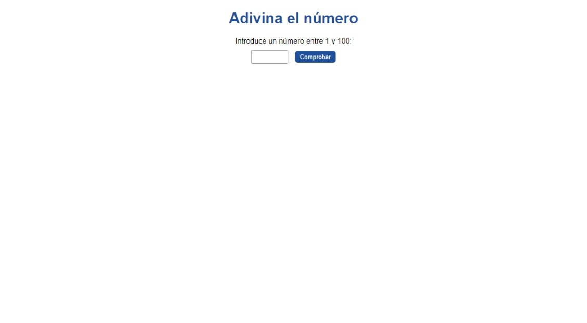

# Adivina-el-numero = Mentalista

Participa y sumérgete aún más.

En esta segunda clase de la Inmersión Dev con Javascript, vamos a crear un juego de adivinanza, el programa elegirá un número aleatorio y nosotros vamos a intentar adivinarlo. Conoceremos más herramientas de lógica de programación, que pueden ser utilizadas juntas y que permiten que nuestros programas sigan por diversos caminos, de acuerdo con la información y datos recibidos.

## Link del proyecto base: [Haz clic aqui](https://codepen.io/Alura-Latam-Inmersion/pen/qBQqawM)

Haz el fork de este proyecto para tu cuenta y marca los hashtags: #InmersionDevAlura y #InmersionDevConJavascript.

## Contenido detallado de esta clase:

Realizar el fork del proyecto con el modelo inicial;
Hacer pruebas utilizando prompt;
Crear la lógica del juego usando estructura de verificación como if y else;
Utilizar la función Math.random() de JavaScript para generar números aleatorios.
Función: var numeroSecreto = parseInt(Math.random() \* 1001);

## ¡Desafíos de esta clase!

Agregar un número de intentos para que la persona intente acertar e imprimir la respuesta al final;
Cuando la persona se equivoque, incluir el número que fue digitado en el mensaje de error e informar en el mensaje si el número digitado es mayor o menor que el número secreto;
Descubrir el número máximo que una persona lleva para adivinar un número correcto;
Investigar y aprender la diferencia entre == y ===.

## Contenidos extras:

[Strict equality (===)](https://developer.mozilla.org/es/docs/Web/JavaScript/Reference/Operators/Strict_equality)

[Math.random() en MDN](https://developer.mozilla.org/es/docs/Web/JavaScript/Reference/Global_Objects/Math/random)

[Operadores con Javascript](https://www.aluracursos.com/blog/como-utilizar-operadores-de-comparacion-en-javascript)

### Miniatura

Site: https://luisangelponcealvarez.github.io/Adivina-el-numero/
